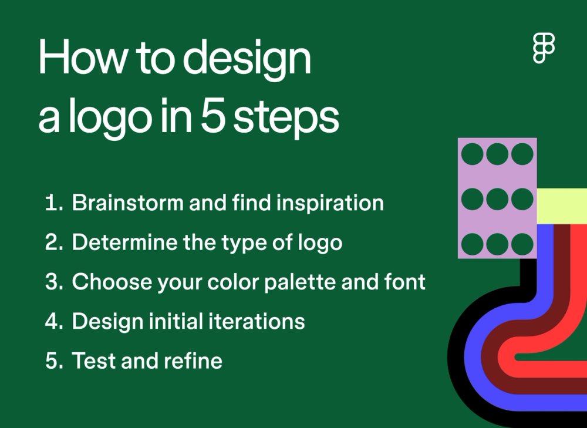
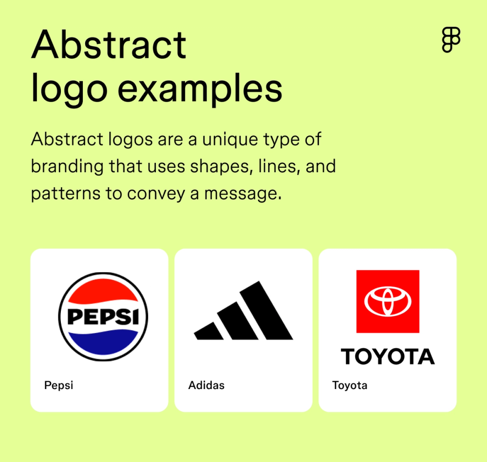
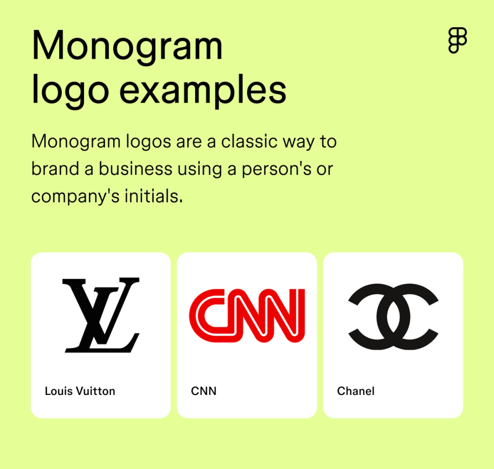
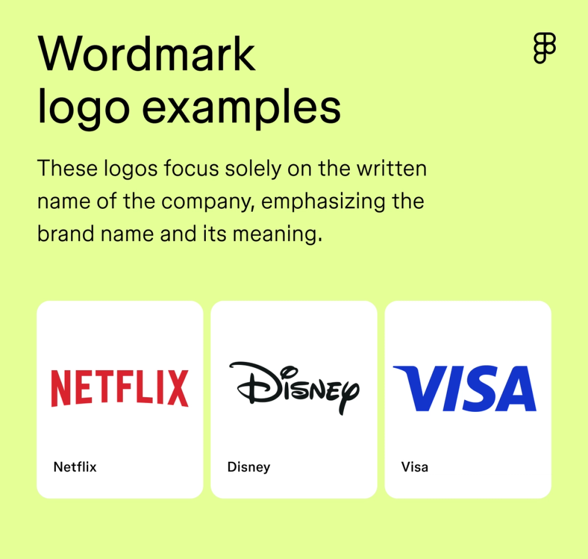

# 12 типов логотипов: справочник

## Процесс создания логотипа

1. **Brainstorm и вдохновение** — понять идентичность бренда, создать mood board, изучить конкурентов.
2. **Выбрать тип логотипа** — подобрать стиль под бренд (см. таксономию ниже).
3. **Палитра и шрифт** — цвета и типографика передают характер.
4. **Итерации и фидбек** — несколько вариантов → тест → доработка.
5. **Финализация** — адаптация под носители (от favicon до билборда).

## Таксономия: 12 типов

### 1. Abstract (абстрактный)

Геометрические формы, линии, паттерны. Нет буквальных символов — зритель сам интерпретирует.

**Лучше для:** tech, консалтинг, финансы, дизайн-студии, wellness.

### 2. Line drawing (линейный)
Минималистичные штрихи. Масштабируются от визитки до билборда. Два подтипа: непрерывная линия (олимпийские кольца) и раздельные штрихи.

**Лучше для:** технологии, мода, креативные агентства.

### 3. Monogram (монограмма)

Инициалы компании, стилизованные в знак. Классика для luxury, семейного бизнеса, ресторанов, арт-студий.

### 4. Letterform (буквенная форма)
Одна буква или стилизованное название. McDonald's «M», Facebook «f». Больше свободы, чем у монограмм.

**Лучше для:** стартапы, медиа, food & beverage, мода.

### 5. Wordmark (логотип-слово)

Название бренда = логотип. Типографика передаёт характер. Netflix — кинематографический, Visa — движение вперёд.

**Лучше для:** любой бренд с запоминающимся именем.

### 6. Mascot (маскот)
Персонаж как лицо бренда. Pringles, KFC, Duolingo. Создаёт эмоциональную связь.

### 7. Emblem (эмблема)
Текст внутри формы (щит, круг, лента). «Гербовый» характер. Starbucks, Harley-Davidson, NFL.

### 8. Combination (комбинированный)
Знак + текст. Самый гибкий формат: можно использовать вместе и раздельно. Burger King, Lacoste, Mastercard.

### 9. Dynamic (динамический)
Логотип меняется в зависимости от контекста (цвет, форма, стиль). Google Doodles, MTV. Требует сильную базовую форму.

### 10. Responsive (адаптивный)
Версии логотипа для разных размеров. Полный → упрощённый → иконка. Важен для digital.

### 11. Geometric (геометрический)
Построен на базовых формах (круг, квадрат, треугольник). Чистый, современный, масштабируемый.

### 12. Negative space (негативное пространство)
Скрытый образ в пустом пространстве. FedEx (стрелка между E и x), WWF (панда). Запоминается мгновенно.

## Принципы хорошего логотипа

- **Простота** — узнаваемость за доли секунды.
- **Масштабируемость** — от favicon 16px до баннера 10 метров.
- **Уникальность** — не путаться с конкурентами.
- **Вневременность** — тренды проходят, логотип остаётся.
- **Уместность** — соответствие отрасли и аудитории.
