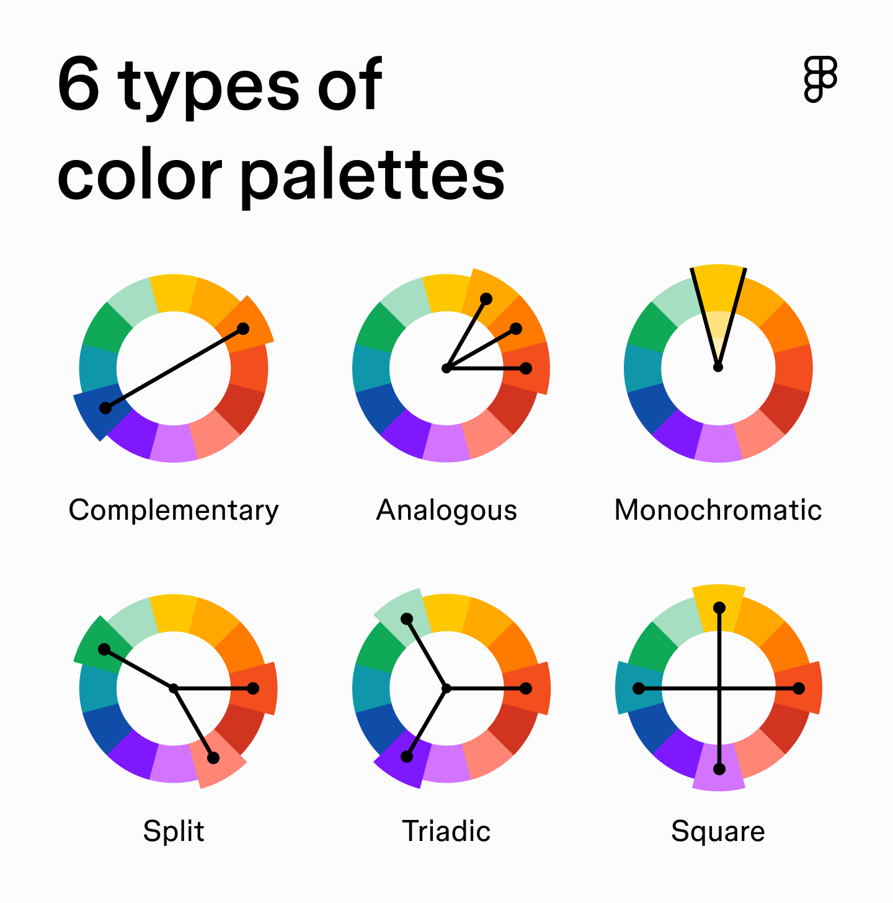
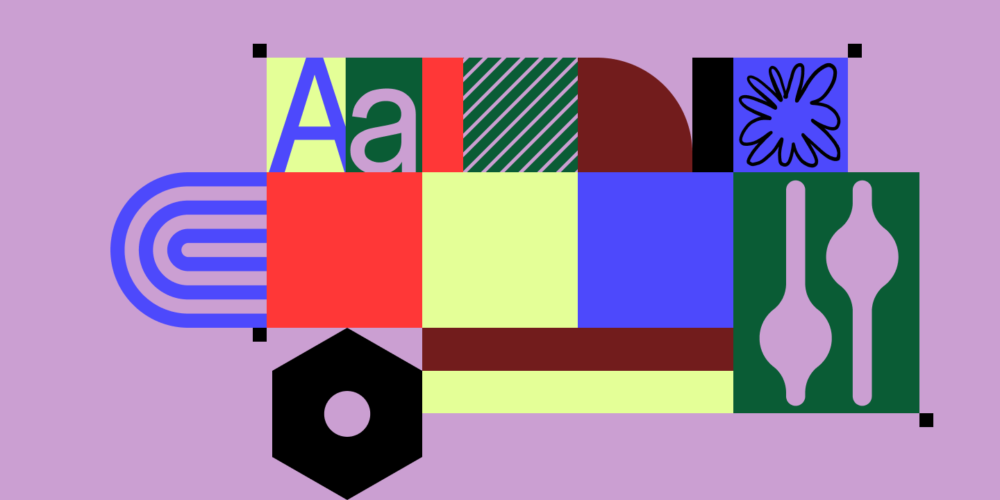

# Цветовые палитры: типы и применение

## Что такое цветовая палитра

Набор цветов, которые дизайнер использует в проекте: обычно один основной, один вспомогательный и один-два акцентных. В UI/UX цвет — инструмент влияния на поведение, эмоции и узнаваемость бренда.

## 6 типов палитр

### 1. Complementary (комплементарная)
Два цвета напротив друг друга на круге (красный + зелёный, синий + оранжевый). Максимальный контраст. Спортивные бренды, CTA-кнопки.

### 2. Analogous (аналогичная)
Соседи на круге (оранжевый + розовый + фиолетовый). Ощущение естества и спокойствия — как закат. Wellness, spa, organic.

### 3. Monochromatic (монохроматическая)
Оттенки одного цвета (светло-голубой → тёмно-голубой). Чисто, минималистично, невозможно «столкнуть» цвета. Banking, productivity.

### 4. Split-complementary (расщеплённая комплементарная)
Базовый цвет + два соседа его комплемента. Контраст мягче, чем у чистой комплементарной. Детские приложения, creative platforms.

### 5. Triadic (триадная)
Три цвета на равном расстоянии по кругу. Энергичная, яркая, требует баланса: один доминирует. Firefox (оранжевый-жёлтый-фиолетовый).

### 6. Square / Tetradic (квадрат / тетрада)
Четыре цвета, равноудалённых на круге. Максимальное разнообразие, но легко перегрузить. Нужны нейтральные цвета для баланса. Slack.

## Примеры палитр по ситуациям

| Палитра | Тип | Лучше для |
|---------|-----|-----------|
| Голубой монохром | Monochromatic | Banking, healthcare, productivity |
| Крем + зелёный + персик | Analogous | Wellness, booking, organic products |
| Лиловый + зелёный | Complementary | Медитация, свадьбы, весенние проекты |
| Пастельный оранж + синий + фиолет | Split-complementary | Детские приложения, creative tools |
| Бежевый + 3 пастельных | Square | Mindfulness, флористика, spa |
| Розовый + голубой + жёлтый | Triadic | Creative platforms, детские приложения |

## Как выбрать палитру

1. **Определите настроение** — бренд весёлый, серьёзный, премиальный, природный?
2. **Начните с одного цвета** — основной цвет бренда.
3. **Выберите схему** — аналогичная для спокойствия, комплементарная для контраста, монохроматическая для минимализма.
4. **Добавьте нейтральные** — белый, серый, чёрный для фона и текста.
5. **Проверьте контраст** — WCAG 4.5:1 для основного текста, 3:1 для крупного.
6. **Тестируйте на реальном UI** — цвета ведут себя иначе рядом с контентом, чем в палитре.

## Полезные инструменты

- **Coolors.co** — генератор палитр с блокировкой отдельных цветов.
- **Adobe Color** — цветовой круг + правила гармонии.
- **Contrast Checker (WebAIM)** — проверка WCAG-контраста.
- **Realtime Colors** — предпросмотр палитры на реальном сайте.
- **Huemint** — AI-генератор палитр с превью на макетах.

