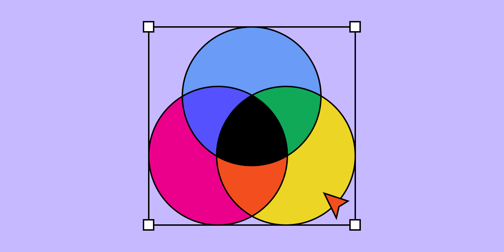
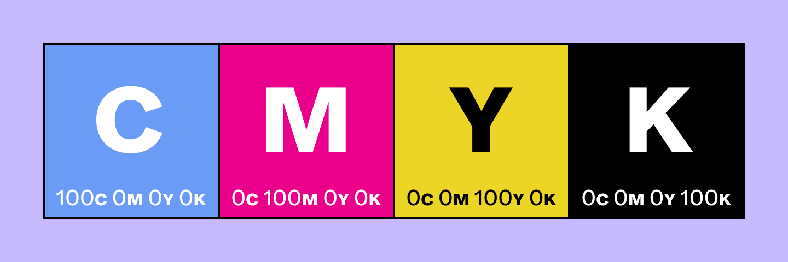
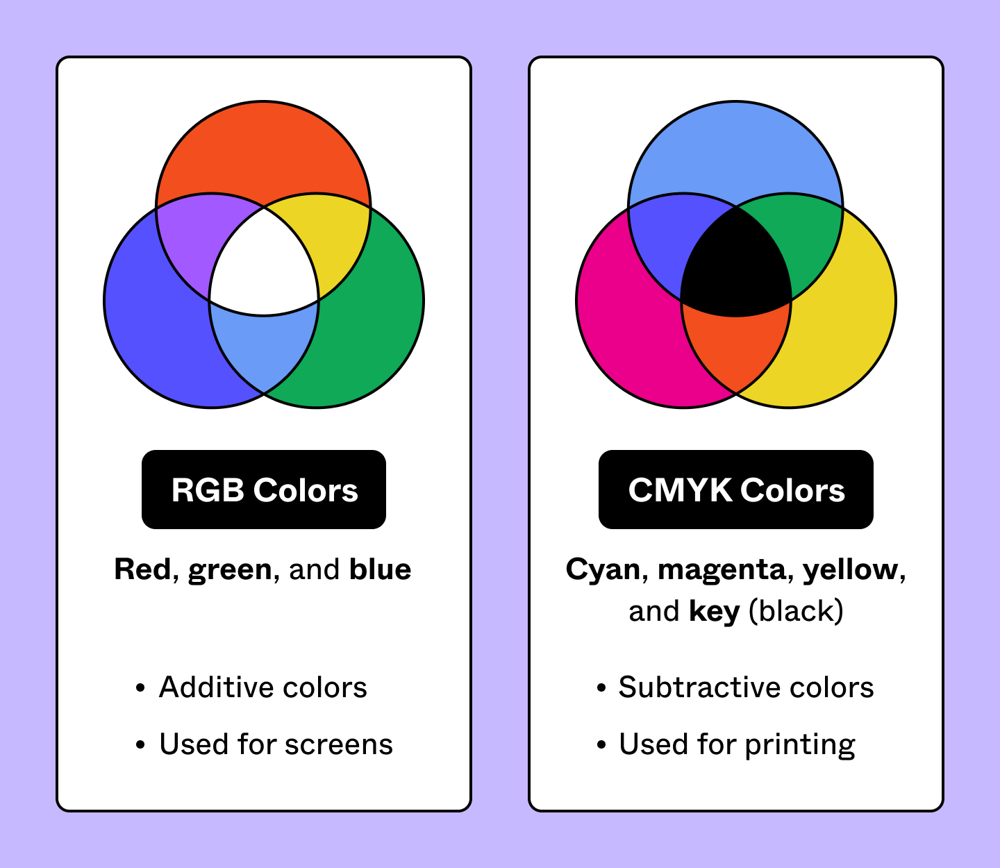

# RGB vs CMYK: развёрнутый справочник

## CMYK

CMYK — **субтрактивная** цветовая модель для печати. Четыре краски поглощают свет и создают цвет:

| Буква | Цвет | Роль |
|-------|------|------|
| C | Cyan (голубой) | Базовый |
| M | Magenta (пурпурный) | Базовый |
| Y | Yellow (жёлтый) | Базовый |
| K | Key (чёрный) | Глубина, контраст, детали |

«K» означает «key» — ключевая пластина в традиционной печати, дающая самые чёткие детали.

### Как смешиваются

- C=0, M=50, Y=100, K=0 → яркий оранжевый.
- C=0, M=0, Y=0, K=100 → обычный чёрный (true black).
- C=60, M=60, Y=60, K=100 → «rich black» (для крупных заливок).

### Лучшие форматы для CMYK

- **PDF** — универсальный, работает везде.
- **AI (Adobe Illustrator)** — для векторной графики.
- **EPS** — вектор с поддержкой CMYK.

## RGB

**Аддитивная** цветовая модель для экранов. Три луча света (Red, Green, Blue) складываются для создания цвета.

- Все три на максимуме = белый.
- Все три на нуле = чёрный.
- Более 16 млн комбинаций.

## Сравнение

| Параметр | RGB | CMYK |
|----------|-----|------|
| Модель | Аддитивная (свет) | Субтрактивная (краска) |
| Среда | Экраны, цифровые медиа | Печать (бумага, ткань, упаковка) |
| Базовые цвета | Red, Green, Blue | Cyan, Magenta, Yellow, Key |
| Количество цветов | 16 млн+ | 16 000+ |
| Яркость | Более яркие, насыщенные | Менее яркие (ограничения краски) |

## Когда использовать что

- **Мобильное приложение, сайт, презентация на экране** → RGB.
- **Визитки, флаеры, упаковка, билборды** → CMYK.
- **Логотип** → создаётся в обоих пространствах; версия для экрана (RGB) и для печати (CMYK).

## Конвертация RGB → CMYK

При конвертации из RGB в CMYK яркие цвета часто тускнеют — gamut CMYK уже. Поэтому:
- Дизайн для печати лучше вести сразу в CMYK.
- Если дизайн создан в RGB, проверьте soft proof перед печатью.
- Некоторые яркие экранные цвета (неон, глубокий фиолетовый) невоспроизводимы в CMYK.
