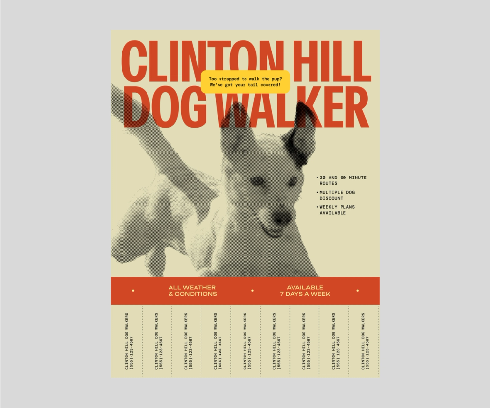
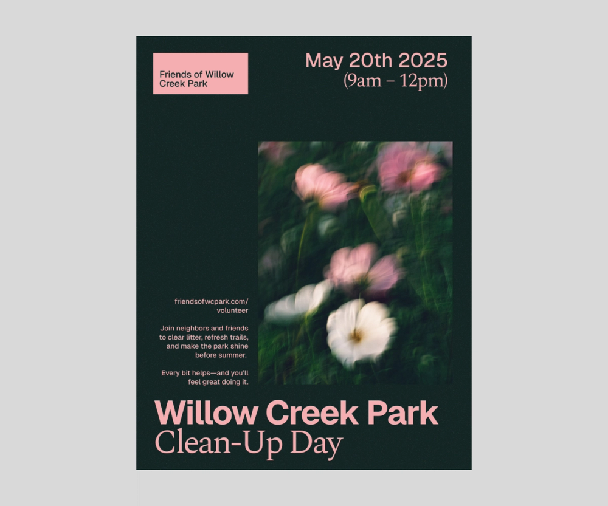

# Print design: развёрнутый справочник

## Как сделать эффективный флаер за 6 шагов

### Шаг 1: Определите цель и аудиторию

Перед началом работы ответьте на вопросы:
- Что вы продвигаете?
- Кто целевая аудитория?
- Какое действие ожидается от читателя?
- Кто скорее всего предпримет действие?
- Как вы оцените эффективность?

Ответы определяют всё — от шрифта до места раздачи. Флаер для нетворкинга ≠ флаер для детского магазина.

### Шаг 2: Соберите материалы

Из brand style guide возьмите:
- Цветовую палитру
- Гайд по копирайту
- Брендовые шрифты
- Изображения и иконки
- Логотип

Обязательный контент:
- **Чёткий заголовок**
- Краткое описание
- **Конкретный CTA** (зарегистрироваться, позвонить, прийти)
- Контактная информация
- Место/время (если применимо)

**Правило:** если человек не может понять суть за 3 секунды — текста слишком много.

### Шаг 3: Спланируйте layout и визуальную иерархию

Используйте размер, расположение и контраст для управления вниманием:
- **Size** — крупный текст = важная информация. Заголовок и CTA — самые крупные.
- **Layout** — ключевое — в верхней трети или центре (зона первого взгляда).
- **Order** — контент расположен в порядке приоритета.
- **Contrast** — жирные шрифты и цветовые акценты — точечно, для фокуса.

### Шаг 4: Выберите шрифты, цвета и изображения

- Максимум 1–2 комплементарных шрифта.
- Ограниченная палитра, соответствующая бренду.
- Контраст текста и фона для читабельности.
- Качество изображений > количество. Лучше без картинок, чем с размытыми.

### Шаг 5: Соберите макет

Работайте в сетке. Элементы выровнены, белое пространство используется осознанно. Не пытайтесь заполнить каждый квадратный сантиметр.

### Шаг 6: Проверьте и доведите

Чеклист перед печатью:
- [ ] CMYK цветовая модель (не RGB)
- [ ] Разрешение ≥ 300 dpi
- [ ] Вылеты (bleeds) — обычно 3mm по каждой стороне
- [ ] Текст не обрезается при финальной обрезке
- [ ] Шрифты встроены или преобразованы в кривые
- [ ] Пробная печать для проверки цветопередачи

## Размеры флаеров (справочник)

| Формат | Размер (мм) | Размер (дюймы) | Применение |
|--------|-------------|----------------|-----------|
| A4 | 210 × 297 | 8.27 × 11.69 | Стандартный информационный |
| A5 | 148 × 210 | 5.83 × 8.27 | Компактный, для раздачи |
| A6 | 105 × 148 | 4.13 × 5.83 | Карточка-приглашение |
| US Letter | 216 × 279 | 8.5 × 11 | Стандарт в США |
| Half Letter | 140 × 216 | 5.5 × 8.5 | Компактный (США) |
| DL | 99 × 210 | 3.9 × 8.27 | Вкладка в конверт |

## Брошюры

Брошюры = многостраничный ритм. Ключевые отличия от флаера:
- **Обложка** — как лендинг: заголовок, образ, CTA «открыть».
- **Развороты** — каждый решает одну тему; повторяемая сетка.
- **Единый стиль** — палитра, шрифты, отступы из гайда.
- **Фолдинг** — тип сгиба влияет на порядок чтения (Z-fold, Gate fold, Tri-fold).

## Thank you cards

Тот же каркас в миниатюре:
- **Цель и тон** — благодарность, тёплый текст.
- **Бренд** — логотип и палитра, но без навязчивой рекламы.
- **Минимум шума** — краткое послание, подпись, возможно QR-код.
