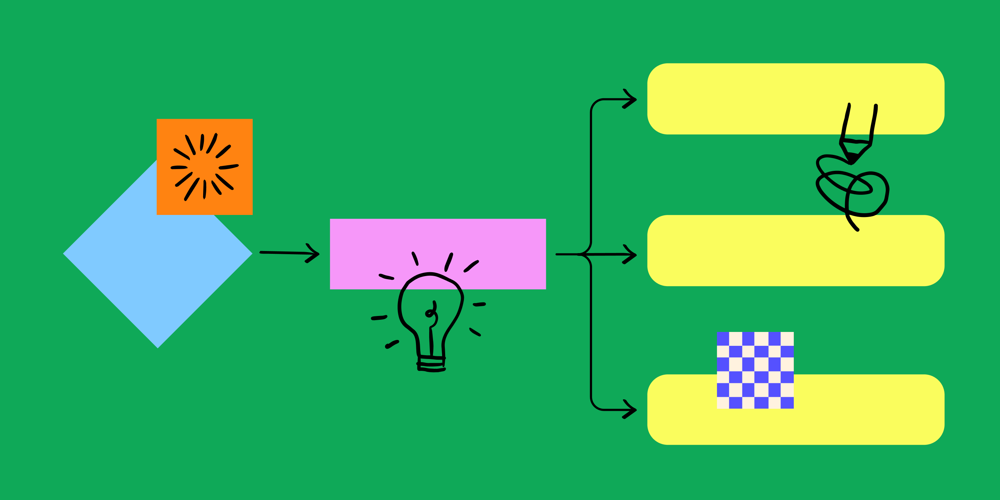
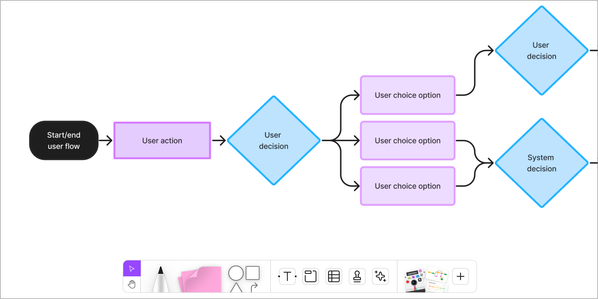

# User flow: развёрнутый гайд

## Что такое user flow

User flow — визуальная дорожная карта пути пользователя. Описывает шаги от начальной точки («Мне нужно это») до конечной точки («Готово, задача выполнена»). Это «чертёж» UX-стратегии.

## Почему user flow важен

- **Гладкий UX** — узкие места обнаруживаются до запуска, а не после.
- **Выравнивание команды** — простая визуализация, вокруг которой можно собраться.
- **Эффективность** — убирает догадки, показывает кратчайший путь к цели.
- **Фокус** — подсвечивает самые критичные задачи.

## 5 шагов создания

### 1. Определите пользователя и его цель
- Кто он? Студент бронирует дешёвые билеты, родитель записывает ребёнка, предприниматель выставляет счёт.
- Что он хочет? Чем яснее цель — тем точнее flow.
- Насколько он технически грамотен? Дизайн должен быть интуитивен для любого уровня.

### 2. Определите точку входа
- Поисковая выдача → лендинг?
- Кнопка «Регистрация» на главной?
- Push-уведомление?

### 3. Нарисуйте шаги
- Первое действие → какие выборы → формы → кнопки → переходы.
- Фиксируйте значимые моменты, не каждый клик.

### 4. Добавьте точки решений
- Не все пользователи идут одним путём. Ошибка, альтернативный выбор, возврат — покажите развилки.
- Развилки — зоны риска фрустрации: формулировки и навигация должны быть кристально ясными.

### 5. Определите конечную точку
- Страница подтверждения покупки.
- Dashboard после онбординга.
- Возврат на предыдущий экран после подзадачи.

## Лучшие практики

- **Один поток = одна цель.** Не смешивайте регистрацию и покупку в одном flow.
- **Простота.** Слишком много ветвей = сложно и для команды, и для пользователя.
- **Консистентность обозначений.** Одни и те же фигуры, цвета и подписи во всех flow.
- **Делитесь рано.** Фидбек на ранней стадии дешевле фикса после разработки.
- **Итерируйте.** Flow — живой документ, обновляйте после тестов и релизов.

## Типы диаграмм (не путать)

| Диаграмма | Фокус |
|-----------|-------|
| **User flow** | Конкретная задача: шаги пользователя от A до B |
| **Task flow** | Один сценарий без вариаций (прямая линия) |
| **Wireflow** | User flow + эскизы экранов |
| **User journey map** | Весь опыт, включая эмоции, мысли, точки контакта |
| **Sitemap** | Иерархия страниц сайта (структура, не поведение) |
