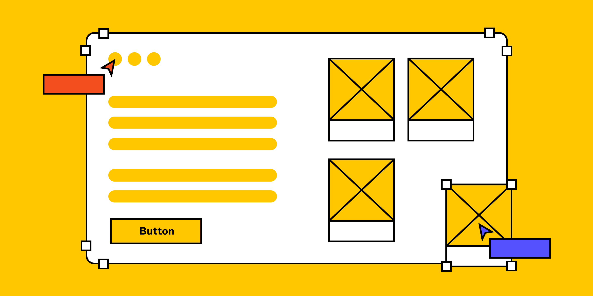
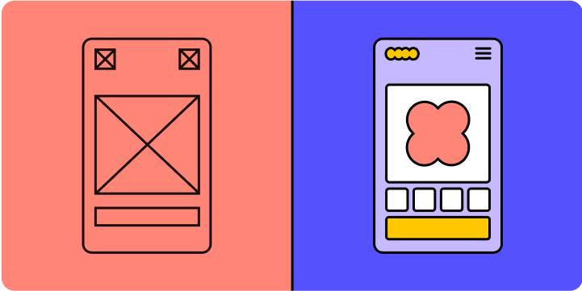

# Wireframing: развёрнутый гайд

## Что такое wireframe

Wireframe — это базовый каркас (blueprint) будущего продукта: показывает структуру экранов, навигацию, расположение компонентов и интерактивных элементов. Это «скелет» приложения или сайта без визуального шума.

## 3 уровня детализации

### 1. Low-fidelity wireframe
- Фокус на layout, навигацию и информационную архитектуру.
- Lorem ipsum и простые прямоугольники вместо изображений.
- Удобен для ранних обсуждений: «Это самое важное?» вместо «Мне не нравится этот цвет».

### 2. Mid-fidelity wireframe
- Добавляются аннотации, реальный контент, ключевые взаимодействия.
- Команда пробует разные подходы к потокам и UI-элементам.
- Финализация структуры до перехода к визуальному дизайну.

### 3. High-fidelity wireframe
- Выглядит как ранний mockup: брендовые шрифты, цвета, логотип.
- Нет функциональности прототипа, но передаёт look & feel.
- Подходит для юзабилити-тестирования и презентации стейкхолдерам.

### Когда пропускать уровни

Если есть устоявшаяся дизайн-система и новый дизайн похож на существующие — можно сразу начинать с high-fi. Обсуждение не «уйдёт в визуал», потому что команда уже привыкла к этим паттернам.

## 7 лучших практик

1. **Определите цели дизайна.** Что пользователь должен делать? Какое действие ведёт к успеху?
2. **Выберите правильный размер.** Mobile: 393×852px, Tablet 11": 834×1194px, Desktop: 1440×1024px.
3. **Начинайте просто.** Grayscale, минимум шрифтов, прямоугольники вместо картинок. Но для контентных страниц используйте реальный текст вместо lorem ipsum.
4. **Поддерживайте консистентность.** Одинаковые компоненты должны выглядеть одинаково на всех wireframes.
5. **Навигация должна быть очевидной.** Если пользователю нужна карта сайта — навигация требует доработки.
6. **Не привязывайтесь к wireframe.** Это черновик, не финальный продукт.
7. **Используйте инструменты.** Wireframe-киты и шаблоны ускоряют работу.

## Чеклист готовности wireframe

- [ ] Все ключевые экраны нарисованы
- [ ] Навигационные пути определены и логичны
- [ ] Контент расставлен по приоритету
- [ ] Интерактивные элементы обозначены
- [ ] Wireframe прошёл внутреннее ревью
- [ ] Учтены размеры под целевые устройства
- [ ] Готов к передаче в mockup / прототип

## Wireframe vs Mockup

| Wireframe | Mockup |
|-----------|--------|
| Структура и приоритеты | Визуальный стиль, бренд |
| Минимум деталей | Цвета, шрифты, реальные изображения |
| Для обсуждения «что» и «куда» | Для обсуждения «как выглядит» |
| Быстрые изменения | Больше работы на изменения |
