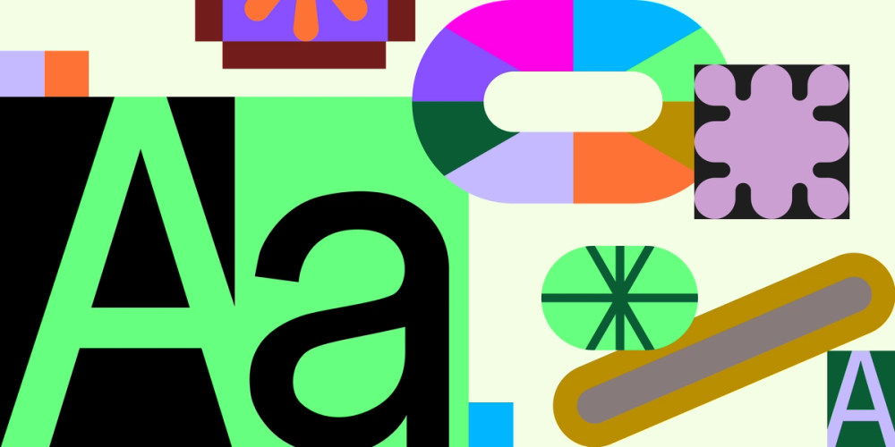

# Шрифтовые пары: гайд

Правильная шрифтовая пара создаёт визуальную структуру, усиливает читабельность и укрепляет дизайн. Ключевой принцип — **контраст ролей**: заголовок и body text должны дополнять друг друга, а не конкурировать.

## Проверенные пары

| Заголовок | Body | Характер | Лучше для |
|-----------|------|----------|-----------|
| **Abril Fatface** (serif) | **Lato** (sans) | элегантный + чистый | luxury, editorial |
| **Fugaz One** (italic display) | **Work Sans** (sans) | энергичный + профессиональный | tech, marketing |
| **Space Mono** (mono) | **Plus Jakarta Sans** (sans) | retro-tech + дружелюбный | tech, portfolio |
| **Grand Hotel** (script) | **Lato** (sans) | рукописный + структурный | свадьбы, boutique |
| **Raleway** (sans) | **Merriweather** (serif) | современный + классический | education, corporate |
| **Playfair Display** (serif) | **Source Sans Pro** (sans) | авторитетный + нейтральный | блоги, журналы |
| **Oswald** (sans condensed) | **Noto Sans** (sans) | плакатный + универсальный | events, posters |
| **Poppins** (geometric sans) | **Inter** (sans) | округлый + функциональный | SaaS, dashboards |

## 5 правил подбора пар

### 1. Контраст, а не конфликт
Пара должна различаться по структуре (serif + sans, display + neutral), но не создавать визуального хаоса. Два декоративных шрифта рядом = нечитаемо.

### 2. Максимум 2–3 шрифта
Один для заголовков, один для body. Третий — только если нужен отдельный акцент (код, цитата). Больше — хаос.

### 3. Согласованная x-height
Если x-height (высота строчных букв) сильно различается, пара будет выглядеть негармонично на одной строке.

### 4. Проверьте на реальном контенте
Lorem ipsum не покажет проблем. Подставьте настоящие заголовки, абзацы, списки. Проверьте в разных размерах и на мобильном.

### 5. Учитывайте вес и стиль
Если заголовочный шрифт жирный и тяжёлый, body text должен быть лёгким и нейтральным. Иначе конкуренция за внимание.

## Где искать пары

- **Google Fonts** — бесплатные, с рекомендациями по парам.
- **Fontpair.co** — специализированный сайт с визуальными примерами.
- **Typewolf** — блог с подборками и трендами.
- **Canva Font Combinations** — генератор визуальных превью пар.
