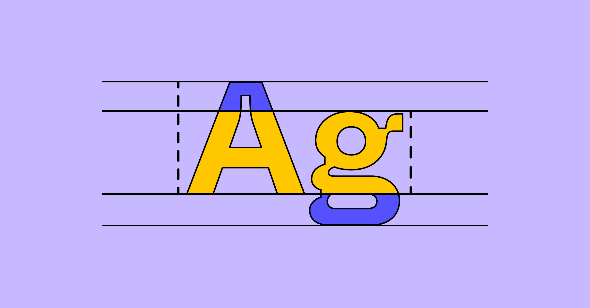
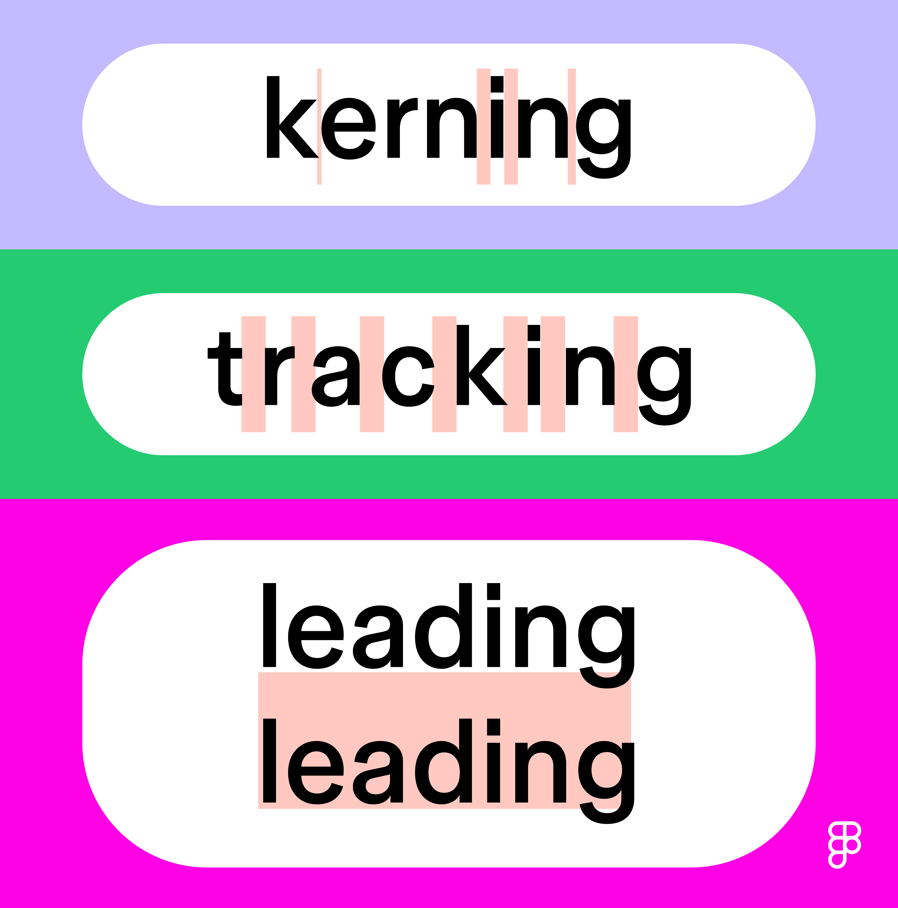
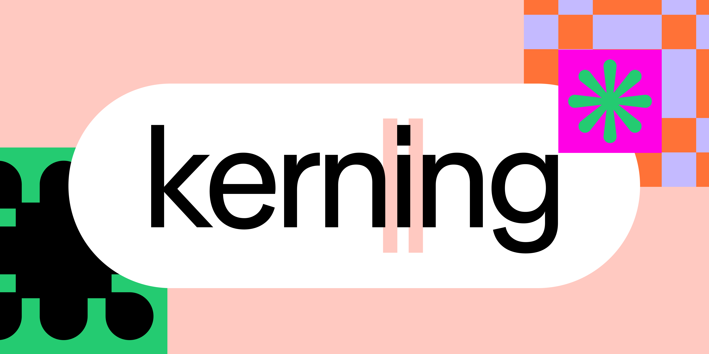
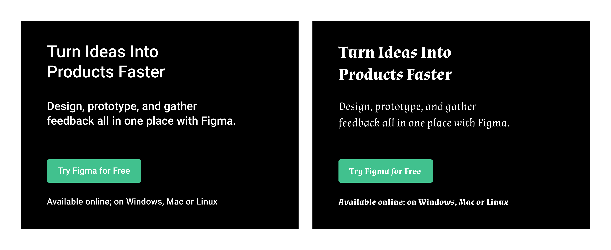

# Типографика: развёрнутый справочник

## Определение

Типографика — искусство и техника создания или выбора системы шрифтов для передачи письменного слова. Хорошая типографика вызывает эмоции через визуально привлекательные буквы, усиливает ясную коммуникацию, улучшает legibility и readability.

## Краткая история

- **1400-е** — Гутенберг, подвижные литеры, готический шрифт.
- **Италия** — Antiqua (Roman) и italic как компактные альтернативы.
- **1700–1800** — первые modern serif.
- **1800–1900** — sans serif доминирует в Европе.
- **XX–XXI век** — Times New Roman, Futura, Helvetica, Arial; огромные библиотеки шрифтов онлайн.

## 5 классов шрифтов (подробно)

### Serif
Короткие штрихи (засечки) на концах букв. Более традиционный, «редакционный» вид. Примеры: Times New Roman, Garamond. Используется: _New York Times_, Sony, J.P. Morgan.

### Sans serif
Без засечек. Чистый, современный вид. Примеры: Helvetica, Arial, Calibri. Используется: Target, Airbnb, DoorDash.

### Script
Курсивный, рукописный. От элегантной каллиграфии до игривого почерка. Не для длинного текста. Примеры: Snell Roundhand, Pacifico.

### Monospace
Фиксированная ширина каждого символа. Стиль печатной машинки. Используется в коде и для ретро-эстетики. Примеры: Courier, Source Code Pro.

### Display
Декоративный, привлекающий внимание. Для логотипов, постеров, крупных заголовков. Не для body text. Примеры: Clearview, Johnston.

## Kerning, Tracking, Leading

### Kerning
Расстояние между **конкретными парами** букв. Происходит от эпохи металлического набора, когда наборщики физически подгоняли блоки для пар типа A+V.

**Типы кернинга:**
- **Default spacing** — стандартные расстояния; механический, не всегда гармоничный.
- **Metric kerning** — значения, заданные дизайнером шрифта.
- **Optical kerning** — софт подгоняет по формам букв (полезно при комбинации разных шрифтов).
- **Manual kerning** — ручная настройка для максимальной точности.

**Когда кернить:**
- Логотипы и заголовки — всегда.
- Body text — обычно достаточно metric/optical.
- При комбинации шрифтов разных семейств.

### Tracking
Равномерное изменение расстояния между **всеми** буквами в слове/строке. Увеличение — воздушный текст; уменьшение — плотный. ALL CAPS часто лучше читается с увеличенным tracking.

### Leading (line-height)
Расстояние между базовыми линиями строк. Термин из ручного набора (свинцовые полоски-разделители).

**Рекомендуемый диапазон:** 112.5%–120% от кегля как стартовая точка. Но каждый шрифт требует индивидуальной подгонки.

## Как влияет выбор шрифта на восприятие

Один и тот же текст в Roboto (чистый sans serif) и в Almendra (каллиграфический) создаёт совершенно разное настроение. Roboto = профессионально и современно. Almendra = детская книга, фэнтези.

## Процесс выбора шрифта

1. **Определите контекст** — экран или печать? Длинный текст или заголовок? Мобильный или десктоп?
2. **Определите тон бренда** — строгий, игровой, премиальный? Создайте mood board.
3. **Исследуйте варианты** — Google Fonts, Adobe Fonts, локальные библиотеки. Ищите визуальные подсказки, совпадающие с брендом.
4. **Проверьте шрифт на бренд-цветах** — чёрный на белом, белый на чёрном, цвет бренда на белом, белый на цвете бренда.
5. **Тестируйте с реальным контентом** — в нескольких размерах, на мобильном и десктопе.
6. **Проверьте лицензию и веб-форматы** — не все шрифты бесплатны для коммерции.

## Weight и style

Typeface содержит семейство fonts (font family). Например, Montserrat: 18 начертаний от Thin (100) до Black Italic (900 italic). Weight обозначается числами:

| Число | Название |
|-------|----------|
| 100 | Thin |
| 200 | Extra-Light |
| 300 | Light |
| 400 | Regular |
| 500 | Medium |
| 600 | Semi-Bold |
| 700 | Bold |
| 800 | Extra-Bold |
| 900 | Black |
