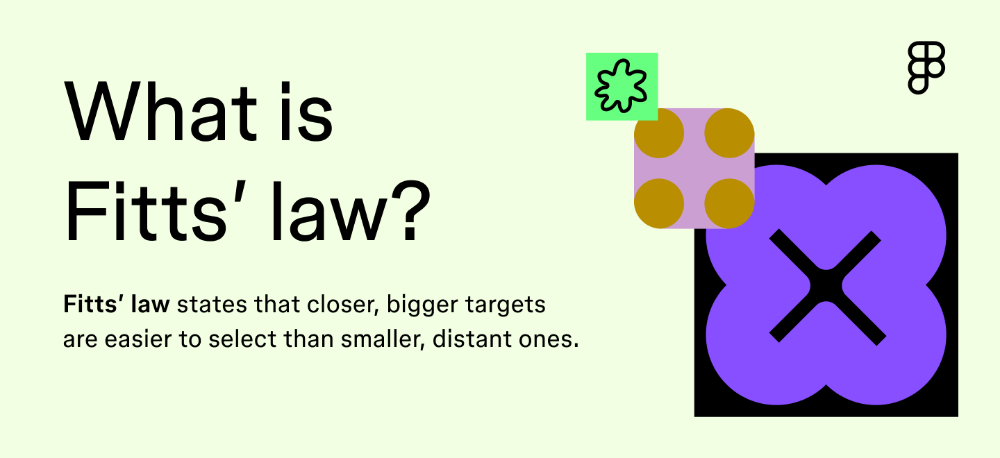
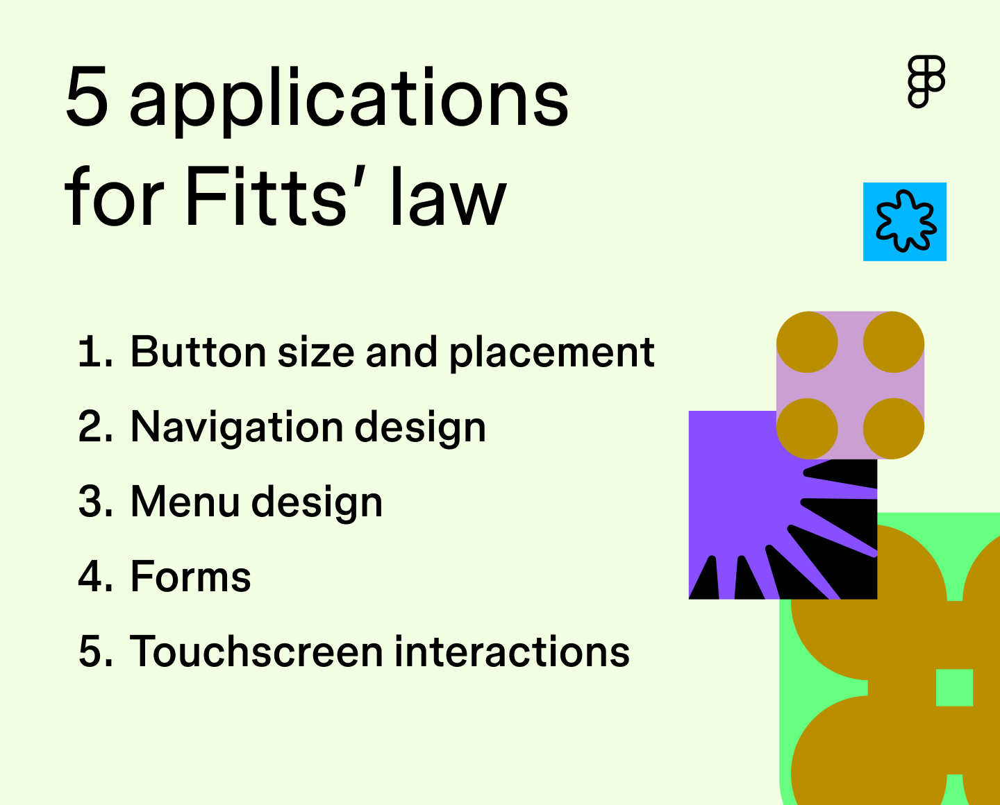

# Закон Фитца (Fitts' Law)

Закон Фитца описывает, как быстро человек может переместить указатель (палец, курсор) к цели. Чем цель крупнее и ближе — тем быстрее попадание.

## Формула

**MT = a + b × log₂(2D / W)**

| Переменная | Значение |
|------------|----------|
| MT | Время перемещения к цели (movement time) |
| a, b | Константы, зависящие от устройства ввода и времени реакции |
| D | Расстояние до цели |
| W | Ширина цели |

## 5 областей применения в UI

### 1. Размер и расположение кнопок
- Основные кнопки и CTA — крупнее и ближе к зоне активности.
- Нет жёсткого правила по размеру; кнопка должна быть достаточно большой для точного клика/тапа, но не настолько, чтобы вытеснять другой контент.
- Часто используемые кнопки — ближе к prime pixel (вероятная позиция курсора).

### 2. Навигация
- Навигационные элементы видимые и достаточно крупные.
- Чем чаще элемент используется, тем ближе он к стартовой точке пользователя.

### 3. Меню
- Основные пункты — крупнее и доступнее, чем второстепенные.
- Минимизируйте вложенность и сложность; каждый уровень вложенности увеличивает время перемещения.

### 4. Формы
- Кнопка отправки — визуально выделена и имеет увеличенную область клика (padding).
- Поля ввода — достаточной высоты для удобного тапа на мобильных.

### 5. Тачскрины и thumb zone

- **Thumb zone** — область, которую пользователь комфортно достаёт большим пальцем, держа смартфон одной рукой.
- CTA — в центре или нижней части экрана, не в дальних углах.
- Нижняя навигация (tab bar) — классический пример применения закона Фитца на мобильных.

## Prime pixel и magic pixels

| Зона | Описание | Что размещать |
|------|----------|---------------|
| **Prime pixel** | Вероятная позиция курсора (центр экрана или место последнего клика) | Основные действия, CTA |
| **Magic pixels** | Четыре угла экрана — максимально далеко от prime pixel | Второстепенные элементы, настройки |

## Советы по применению

- **Proximity + spacing:** группируйте связанные элементы, но оставляйте расстояние, чтобы избежать ошибочных кликов. «Save» и «Cancel» рядом для сравнения, но не вплотную.
- **Padding вместо размера:** вместо увеличения визуального размера кнопки используйте padding для расширения области клика — сохраняет визуальную иерархию.
- **Тестирование:** наблюдайте, где пользователи замедляются, ошибаются, действуют уверенно. Метрики: время выполнения задач, частота ошибок, пути.
- **Итерации:** размеры и расположение — постоянный эксперимент. Изменение одного элемента влияет на весь макет.
