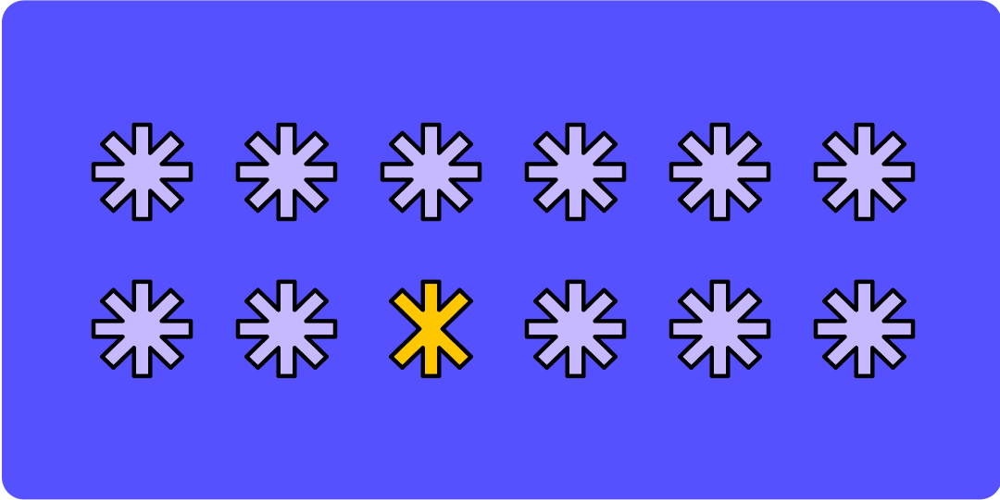

# Визуальная иерархия

Визуальная иерархия — практика расположения элементов в порядке важности, чтобы направлять внимание пользователя к нужному контенту и действиям. Что бросается в глаза первым? Куда взгляд перемещается дальше? Выполняет ли пользователь целевое действие?

## 7 инструментов визуальной иерархии

### 1. Alignment (выравнивание)
Выровненные элементы воспринимаются как связанные. Сетка и выравнивание — фундамент читабельного макета.

### 2. Color (цвет)
Яркость и насыщенность задают порядок считывания. Используйте палитру с хорошим контрастом; контролируйте luminance. Яркий акцент на ключевых элементах, нейтральные тона для фона и второстепенного.

### 3. Contrast (контраст)
Когда заметно различающиеся элементы расположены рядом, различие усиливается. Тёплый / холодный, комплементарные цвета, светлый текст на тёмном фоне. Контрастное соотношение влияет на доступность (WCAG 4.5:1 для текста).

### 4. Proximity (близость)
Близкие элементы = одна группа. Чанкинг информации помогает сканировать: вместо стены текста — блоки по 3–5 элементов.

### 5. Size (размер)
Крупное считывается первым. Размер кнопок и текста влияет на доступность: пользователи со слабым зрением должны иметь возможность увеличить контент.

### 6. Texture (текстура)
Тактильная подсказка о функции. Скевоморфизм — имитация реальных материалов; может казаться устаревшим, но текстура эффективна для акцентов, когда вместо цвета нужен другой канал выделения.

### 7. Time (время)
Экраны динамичны: анимация, переходы, progressive disclosure. Разбивайте информацию на шаги — каждый экран решает одну задачу, снижая когнитивную нагрузку.

## 5 практических советов

1. **Знайте контекст пользователя.** Мобильное устройство в руке спешащего человека ≠ десктоп в тихом офисе. Дистанция до экрана, внимание, одна рука или две — всё влияет на иерархию.
2. **Медиум определяет приоритет инструментов.** Для билборда главное — scale. Для мобильного приложения — proximity и size. Для печатного плаката — contrast и alignment.
3. **Экспериментируйте и тестируйте.** Когда всё выглядит одинаково — ничего не выделяется. Итерации и A/B-тестирование покажут, работает ли иерархия.
4. **Меньше = больше.** Белое (негативное) пространство — мощный инструмент. Часто люди перегружают макет; уберите лишнее, и важное станет заметнее.
5. **Progressive disclosure.** Разделяйте информацию на последовательные экраны/этапы. Пользователь не должен видеть всё сразу — покажите нужное в нужный момент.
