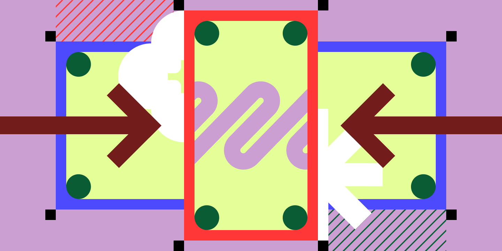
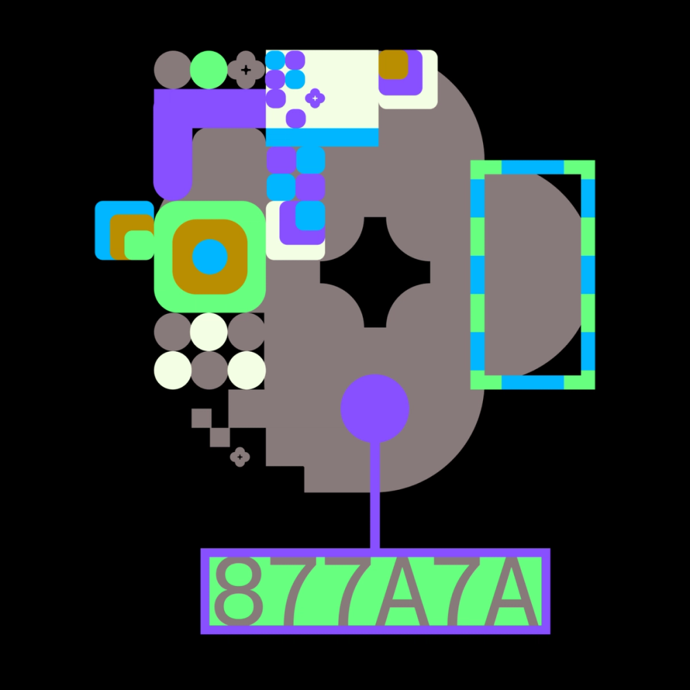
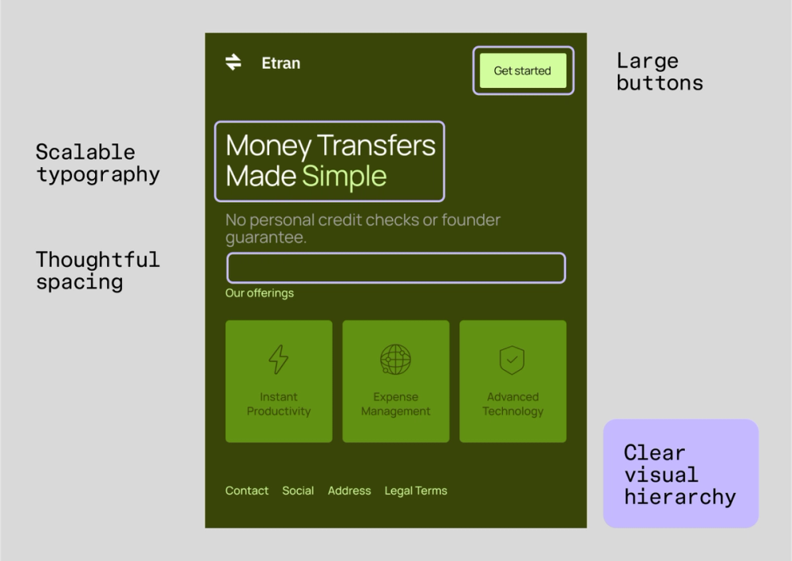

# Responsive design и Mobile-first подход

## Responsive design

Responsive design — подход, при котором сайт автоматически адаптируется под любой экран: десктоп, планшет, телефон. Не «уменьшить всё», а перестроить layout, контент и типографику под конкретную ширину.

### Почему это важно

- **UX**: 74% пользователей возвращаются на мобильно-дружелюбные сайты.
- **Эффективность**: один код вместо отдельных версий для каждого устройства.
- **Конверсия**: единая визуальная иерархия и CTA на всех экранах.
- **Доступность**: семантический HTML + responsive = лучше для screen readers.
- **Стоимость**: одна версия дешевле в поддержке.

### Responsive-фреймворки (обзор)

| Фреймворк | Лучше всего для | Преимущества |
|-----------|-----------------|-------------|
| Bootstrap | Быстрый прототипинг, готовые компоненты | Grid-система, media queries из коробки |
| Pure CSS | Небольшие проекты, точный контроль | Лёгкий, без зависимостей |
| Foundation | Сложные сайты с Sass | Гибкая сетка, accessibility-фокус |
| Semantic UI | Accessibility и читаемость кода | Семантические имена классов |
| Tailwind CSS | Высокая кастомизация | Утилитарные классы, responsive-варианты |

### Ключевые компоненты

- **Гибкая сетка** — колонки и строки, адаптирующиеся под ширину.
- **Media queries** — CSS-правила, срабатывающие при определённых breakpoints.
- **Гибкие изображения** — `max-width: 100%`, responsive images с `srcset`.
- **Breakpoints** — точки переключения layout (mobile → tablet → desktop).

## Mobile-first design

Mobile-first — подход, при котором дизайн начинается с маленького экрана и расширяется. Вместо «урезать десктоп» — «построить мобильный, потом дополнить».

### Ключевые принципы

1. **Content inventory и приоритизация** — определите, что действительно нужно пользователю на ходу. Аудит контента → организация по целям → минимум на экране.

2. **Сначала маленький экран** — responsive layouts, читабельные шрифты, правильные отступы. Смартфон → планшет → десктоп.

3. **Упрощённая навигация** — hamburger-меню, bottom navigation bar, thumb zone. Чёткая иерархия, знакомые паттерны.

4. **Touch-friendly элементы** — крупные кнопки, достаточные отступы между тап-зонами, интуитивные жесты.

5. **Оптимизация производительности** — сжатие изображений, минимум скриптов, лёгкие фреймворки. На медленных мобильных сетях каждый килобайт на счету.

6. **Масштабируемая типографика** — fluid typography и spacing-системы; текст читабелен от 320px до 2560px.

7. **Тестирование на реальных устройствах** — симуляторы полезны, но реальный телефон с медленным 3G покажет правду.

### Mobile-first vs Responsive

| Mobile-first | Responsive |
|-------------|-----------|
| Начинаем с мобильного, расширяем | Адаптируем любой экран (часто с десктопа вниз) |
| Фокус на эссенциалах | Фокус на адаптации всего |
| Гарантирует, что мобильная версия не будет «обрезком» | Может привести к тяжёлой мобильной версии |

**Лучший подход**: mobile-first responsive — начать с мобильного, затем расширять с помощью media queries.
